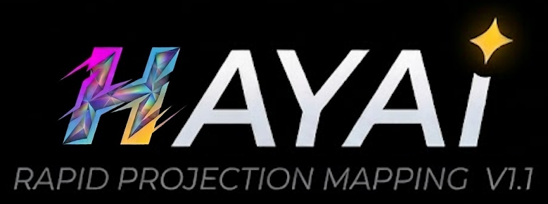

<p align="center">
  
</p>

# Hayai v1.1

**Rapid Video Projection Mapping for Everyone**

Hayai is a fast, free, and beginner-friendly projection mapping tool with perspective-correct texture Keystoneing. The name "hayai" (速い) means "fast" in Japanese-reflecting both its quick setup time and real-time performance suitable for live shows.

## Features

- **Beginner-Friendly** - Intuitive UI with on-screen hints and tooltips
- **Fast Setup** - Create and map shapes in seconds, not hours
- **Live Performance Ready** - GPU-accelerated OpenGL rendering for smooth real-time playback
- **Groups & Hierarchy** - Organize shapes into groups for easier management
- **Imagery Management** - Centralized panel for managing all texture sources
- **Perspective Correction** - Advanced inverse bilinear interpolation for accurate texture Keystoneing
- **Animation Support** - Load animated GIFs and video files directly onto shapes
- **Desktop Capture** - Capture any region of your desktop as a live texture source
- **Video Pipe Input** - Receive live video from other applications via Spout
- **HSV Color Control** - Adjust hue, saturation, value, and alpha per shape
- **Free for Non-Commercial Use** - Licensed under PolyForm Noncommercial 1.0.0

## Installation

> **Primary platform: Windows.**
- Core features (shape creation, texture mapping, animations) should work on macOS and Linux but **have not been tested**.
- Desktop Capture and Video Pipe (Spout) features **currently requires Windows**.

### Step 1 - Install Python

You need Python 3.10 or higher. If you already have it, skip to Step 2.

<details>
<summary><strong>Windows</strong></summary>

1. Go to [python.org/downloads](https://www.python.org/downloads/) and click the big yellow download button.
2. Run the installer. **Important: check the "Add Python to PATH" box** at the bottom of the first screen before clicking Install.
3. Open a terminal to verify: press `Win+R`, type `cmd`, press Enter, then type `python --version`. You should see something like `Python 3.12.x`.

</details>

<details>
<summary><strong>macOS</strong></summary>

1. Go to [python.org/downloads](https://www.python.org/downloads/) and download the macOS installer.
2. Run the `.pkg` file and follow the prompts.
3. Open Terminal (Applications > Utilities > Terminal) and type `python3 --version`. You should see something like `Python 3.12.x`.

> *Advanced users: you can also install via [Homebrew](https://brew.sh) with `brew install python`.*

</details>

<details>
<summary><strong>Linux</strong></summary>

Open a terminal and run `sudo apt install python3 python3-venv python3-pip`. *(If you're not on Ubuntu/Debian, use your distribution's package manager.)*

Verify with `python3 --version`.

</details>

### Step 2 - Download Hayai

1. Go to the [Hayai GitHub page](https://github.com/adam-croston/HayaiPy).
2. Click the green **Code** button near the top-right.
3. Click **Download ZIP**.
4. Find the downloaded `.zip` file (usually in your Downloads folder), right-click it, and **extract** (unzip) it to a location of your choice. This creates a folder with all of Hayai's files inside.

### Step 3 - Open a Terminal in the Hayai Folder

You need a terminal (also called "command prompt") open inside the folder you just extracted.

<details>
<summary><strong>Windows</strong></summary>

1. Open the extracted Hayai folder in File Explorer.
2. Click the **address bar** at the top (where it shows the folder path).
3. Type `cmd` and press **Enter**. A Command Prompt window will open, already in the right folder.

</details>

<details>
<summary><strong>macOS</strong></summary>

1. Open **Terminal** (Applications > Utilities > Terminal).
2. Type `cd ` (with a space after it), then **drag the Hayai folder** from Finder into the Terminal window. Press **Enter**.

</details>

<details>
<summary><strong>Linux</strong></summary>

Right-click inside the Hayai folder and choose **Open Terminal Here**. Or open a terminal and type `cd /path/to/HayaiPY` (substituting the actual path).

</details>

### Step 4 - Set Up a Virtual Environment (Optional)

This step is optional but recommended. A virtual environment is a private space for Hayai's dependencies so they don't interfere with other software on your computer. If you skip this step, the remaining steps still work the same.

<details>
<summary><strong>Windows</strong></summary>

```
python -m venv .venv
.venv\Scripts\activate
```

</details>

<details>
<summary><strong>macOS</strong></summary>

```
python3 -m venv .venv
source .venv/bin/activate
```

</details>

<details>
<summary><strong>Linux</strong></summary>

```
python3 -m venv .venv
source .venv/bin/activate
```

</details>

You'll know it worked when your terminal prompt changes to show `(.venv)` at the beginning.

### Step 5 - Install Dependencies

<details>
<summary><strong>Windows</strong></summary>

```
pip install -r requirements.txt
```

This installs everything, including Windows-only features like desktop capture and video pipe.

</details>

<details>
<summary><strong>macOS</strong></summary>

```
pip3 install -r requirements-base.txt
```

This installs the cross-platform dependencies. Desktop Capture and Video Pipe features are not available on macOS.

</details>

<details>
<summary><strong>Linux</strong></summary>

```
pip3 install -r requirements-base.txt
```

This installs the cross-platform dependencies. Desktop Capture and Video Pipe features are not available on Linux.

</details>

### Step 6 - Run Hayai

<details>
<summary><strong>Windows</strong></summary>

```
python hayai.py
```

</details>

<details>
<summary><strong>macOS</strong></summary>

```
python3 hayai.py
```

</details>

<details>
<summary><strong>Linux</strong></summary>

```
python3 hayai.py
```

</details>

The Hayai window should appear. You're ready to go!

### Troubleshooting

- **`python` is not recognized / not found** - Python wasn't added to your system PATH. On Windows, re-run the Python installer and check "Add Python to PATH". On macOS/Linux, use `python3` instead of `python`.
- **`pip` is not recognized / not found** - On macOS/Linux, use `pip3` instead of `pip`. If that doesn't work, try `python3 -m pip install -r requirements-base.txt`. On Windows, try `python -m pip install -r requirements.txt`.
- **Permission errors on macOS/Linux** - Don't use `sudo`. Make sure you're inside an activated virtual environment (Step 4).

### Dependencies

*You don't need to install these individually - the requirements files handle everything automatically.*

**Core** (all platforms - included in both `requirements.txt` and `requirements-base.txt`):

| Package | What it does |
|---------|-------------|
| pygame-ce | Window management and user interface |
| PyOpenGL + PyOpenGL-accelerate | GPU-accelerated graphics rendering |
| Pillow | Image loading and processing |
| NumPy | Math operations for coordinate transforms |
| opencv-python | Video file playback (MP4, AVI, MOV) |

**Windows-only** (included in `requirements.txt` only):

| Package | What it does |
|---------|-------------|
| mss | Screen capture for the Desktop Capture feature |
| pywin32 | Windows system integration for desktop capture |
| SpoutGL | Video pipe input from other applications via the Spout protocol |

## Usage

Hayai is designed for video projection mapping where the projector displays onto physical surfaces. The application starts in windowed mode-press **F11** for fullscreen when projecting.

### Workflow

1. **Physical Setup**: Position your projector aimed at the target surface(s).
   - **Turn Off Keystoning**: Turn off any in-projector keystone corrections.
   - **Set Focus**: Set any focus control to be in the center of the surfaces.
   - **Go Fullscreen**: Use **F11** for fullscreen on your projector output.
2. **Create Shapes**: Click "Freeform" or "Regular" to trace the edges of physical surfaces
   - **Fine-Tune Shapes**: Switch to "Modify Stencil" mode to add, remove, or move vertices to refine your shapes
3. **Add Imagery**: Select shape(s), then expand the imagery panel (right edge or press **I**) and click + to add an image, animation, desktop capture, or video pipe - imagery is automatically assigned to the selected shape(s). You can also reassign imagery later by selecting a shape and clicking a different imagery item.
   - **Fine-Tune Imagery**: Adjust HSV and alpha for color matching between surfaces
4. **Set Keystoning**: Click "Edit Keystone" mode and drag the 4 corners to match the perspective of each surface. AKA Keystone correction.
   - **Fine-Tune the Keystone Correction**: In the Properties panel edit the Perspective X and Perspective Y sliders to adjust more extreme perpsective effects. You can also use the mouse wheel to adjust these values and mouse middle click to switch between adjusting perspective X and Perspective Y.
5. **Complete Your Scene**: Repeat steps 2,3,4 until the scene is complete.
6. **Go Live**: Press **SPACE** to hide the UI and show only your mapped content.

### Tips for Live Performance

1. **Use F11** to go fullscreen on your projector output
2. **Prepare your scene** ahead of time and save it
3. **Press SPACE** to hide all UI elements during the show
4. **Use groups** to move multiple shapes together and assign imagery together
5. **Animated GIFs and videos** loop automatically-great for dynamic content
6. **Desktop capture** can display live content from other applications like synchronized youtube videos or music visualizers
7. **Spout input** enables integration with VJ software like Resolume, TouchDesigner, etc.

### Operating Modes

| Mode | Description |
|------|-------------|
| **Freeform** | Click to place vertices, click near start or press ENTER to close, ESC to cancel |
| **Regular** | Click to place regular polygons (3-120 sides) |
| **Move Shape** | Select, move, rotate, scale, and manage shapes |
| **Edit Stencil** | Add, move, or delete individual vertices |
| **Edit Keystone** | Adjust the 4-corner perspective Keystone |

### Keyboard Shortcuts

#### Global
| Key | Action |
|-----|--------|
| `SPACE` | Toggle UI visibility (play mode) |
| `F11` | Toggle fullscreen |
| `ESC` | Cancel freeform shape / Deselect vertex / Deselect shape |
| `S` | Toggle scene panel |
| `I` | Toggle imagery panel |
| `T` | Toggle tools panel |
| `U` | Toggle UI (display) panel |
| `P` | Toggle properties panel |
| `H` / `?` | Toggle hints panel |
| `Ctrl+Z` | Undo |
| `Ctrl+Y` | Redo |
| `Ctrl+C` | Copy selected |
| `Ctrl+V` | Paste |
| `Ctrl+G` | Group selected shapes |
| `Ctrl+U` / `Ctrl+Shift+G` | Ungroup |
| `F2` | Rename selected item |
| `TAB` / `Shift+TAB` | Navigate UI buttons |
| `Arrow Keys` | Move selection (Shift = 10x speed) |

#### Move Shape Mode
| Input | Action |
|-------|--------|
| Click | Select shape (selects entire group) |
| Shift+Click | Select individual shape within group |
| Ctrl+Click | Add to selection |
| Drag | Move selection |
| Right-drag | Rotate selection |
| Mouse wheel | Scale selection (Ctrl=1%, Shift=10%) |
| `DEL` | Delete selected |
| `FlipX` / `FlipY` buttons | Flip horizontal / vertical |

#### Edit Stencil Mode
| Input | Action |
|-------|--------|
| Click vertex | Select vertex |
| Drag vertex | Move vertex |
| Click edge | Add new vertex |
| `DEL` | Delete selected vertex |
| Arrow keys | Move vertex precisely |

#### Edit Keystone Mode
| Input | Action |
|-------|--------|
| Drag corner | Adjust Keystone point |
| Right-drag | Rotate Keystone only |
| Mouse wheel | Adjust perspective amount |
| Middle-click | Switch perspective axis (X/Y) |
| Arrow keys | Move all Keystone points |
| `Fit` button | Reset Keystone corners to stencil bounds |

### Mouse Controls Summary

| Button | Action |
|--------|--------|
| Left click | Select / Place / Drag |
| Right drag | Rotate |
| Middle click | Switch perspective axis (Edit Keystone mode) |
| Scroll wheel | Scale (Move mode) / Perspective (Keystone mode) |

### Imagery Panel

The collapsible panel on the right edge manages all texture sources. Press **I** or click the panel edge to expand/collapse.

**Imagery Types:**
- **Image** - Static images (PNG, JPG, BMP)
- **Animation** - Animated GIFs and video files (MP4, AVI, MOV) with a speed control
- **Desktop Capture** - Live capture of any screen region
- **Video Pipe** - Live input from other applications via Spout

**Desktop Capture:**
1. Click the capture button (+screen icon) in the imagery panel
2. A green overlay window appears on your desktop
3. Move and resize the overlay to select the capture region
4. The captured area updates live on any shapes using this imagery

**Video Pipe (Spout):**
1. Click the pipe button in the imagery panel
2. Enter the Spout sender name to connect to
3. Live video from the sender appears on shapes using this imagery

### Properties Panel

The collapsible properties panel (press **P** or click the header) adapts to your selection:

**Single Shape:**
- **Name** - Editable shape name
- **Anim Offset** - Animation playback offfset for GIFs
- **Alpha** - Transparency (0 = invisible, 1 = opaque)
- **Hue** - Rotate colors around the color wheel (0-360°)
- **Saturation** - Color intensity (0 = grayscale, 2 = oversaturated)
- **Brightness** - Brightness level (0 = black, 2 = overbright)
- **Perspective X/Y** - Fine-tune perspective distortion

**Group:** Shows name and transform info (position, rotation, scale)

**Multiple Items:** Shows selection count and lists selected item names with type indicators

### Display Options

The collapsible UI panel (press **U** or click the header) contains display toggles and sliders:

- **Geometry** - Show/hide shape outlines and Keystone corners
- **Stencil** - Enable/disable stencil clipping (clip texture to stencil polygon)
- **Cursor** - Show/hide system cursor
- **Crosshair** - Show/hide cursor crosshair overlay
- **Grid** - Show/hide background grid
- **HitViz** - Show/hide hit area visualization circles
- **Hit Area** slider - Scale the click detection radius for vertices, edges, and handles
- **UI Scale** slider - Scale the size of all UI elements

### File Operations

- **Save Scene** - Save project as `.hayai` file (JSON format)
- **Load Scene** - Open a saved project
- **New Scene** - Clear everything and start fresh
- **Drag & Drop** - Drop images directly onto shapes, or drop `.hayai` files to load

### Supported File Formats

| Type | Formats |
|------|---------|
| Images | PNG, JPG, JPEG, GIF (animated), BMP |
| Video | MP4, AVI, MOV |
| Projects | .hayai, .json |

## Credits

- Original Processing version by Adam Croston (2022)
- Python rewrite and enhancements by Adam Croston (2026)

## License

As of version 1.1, this software is licensed under the [PolyForm Noncommercial License 1.0.0](https://polyformproject.org/licenses/noncommercial/1.0.0/). Previous versions remain available under their original terms (Creative Commons BY-SA 4.0).

This license allows:
- **Personal use** - Use Hayai for your own non-commercial projects
- **Research use** - Use Hayai in academic and research settings

Commercial use requires a separate agreement. Contact **TheAdamCroston@gmail.com** for commercial licensing options.
